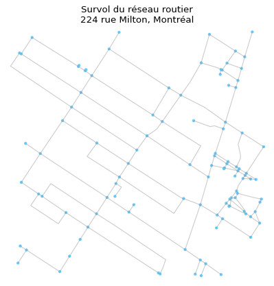

# Optimisation hivernale

Afin de faciliter l'utilisation et la visualisation des résultats plusieurs packages supplémentaires sont nécessaires. Il sont listés dans le fichier *requirements.txt*.

## Comment marche le script du drone ?

L'ensemble des fonctions qui génèrent un chemin sont présentes dans le fichier drone.py. Cependant il n'est pas recommandé de les utiliser directement. Il est plus intéressant d'utiliser les scripts de contrôle fournis.

Premièrement il est nécéssaire d'avoir un fichier de donnée géographique au format .osm. Plusieurs fichiers en .osm sont déjà fournis dans le dossier *data*. Attention le fichier *5635 Rue Saint-Dominique* possède un temps de traitement très élevé. Le script *generate_osm* vous permet **de générer un fichier osm à partir d'une adresse**, il s'utilise de la façon suivante:

```
./generate_osm [-h] [-d DISTANCE] address
```

* `address` correspond à l'adresse à partir de laquelle les données géographiques vont être téléchargées
* `-d` est la distance d'échantillonnage en m, par défaut une zone de 1000m autour de l'adresse est récupérée

Le fichier téléchargé va être placé automatiquement dans le dossier *data*.

À partir de ce fichier de donnée géographique il est possible de générer le parcours du drone. Pour cela il faut utiliser le script *drone_simulation*. Une utilisation basique de ce script serait:

```
./drone_simlmation mon_fichier_osm -a
```

Il est important de noter que vos fichier osm doivent être placés dans le dossier data. Le programme va aller les chercher automatiquement dans ce dossier, il n'est pas non plus nécéssaire de préciser le chemin depuis le répertoire courant (ne pas faire *data/truc.osm* mais *truc.osm* directement).

L'option `-a` est utilisée pour générer une animation du parcours du drone. Il est vivement recommandé de l'utiliser. À ce stade un gif devrait être créé dans le répertoire courant, comme par exemple



Je vous laisse inspecter les autres options disponibles avec `-h`.

Pour récupérer les liste des arrêtes visités par le drone vous pouvez utiliser la fonction `drone_path(fichier_osm)` dans drone.py.

## Lancer la déblayeuse

Deux fichiers python sont fournis *Deneige.py* et *FinalDeneige.py*. Le premier peut être ignorée, il correspond à une première tentative de répondre au problème. Le second apporte la réponse expliqué dans la rapport. Pour comprendre son fonctionnement je vous laisse regarder directement dans le fichier *FinalDeneige.py* qui est commenté.

Pour tester le fonctionnement vous pouvez regarde et lancer  le script *deneige_simlation*.